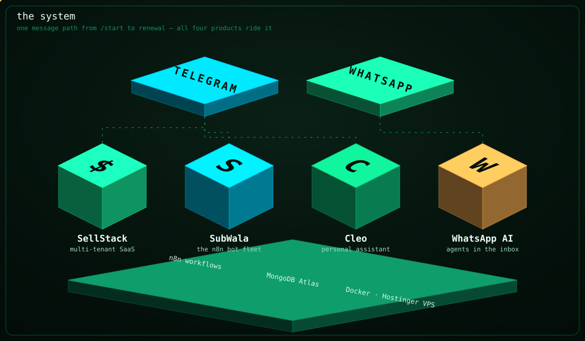
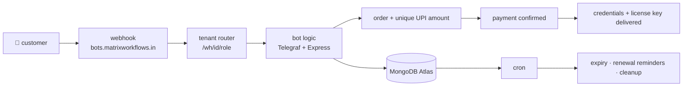
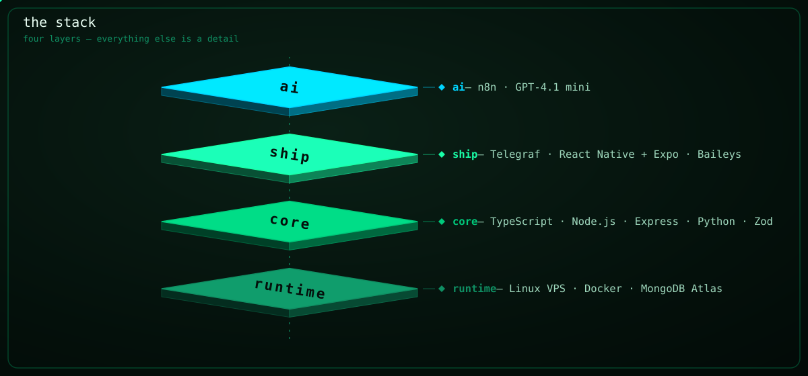

<p align="center">
  
</p>

<!-- ⬡ 3D upgrade — page system inspired by Mayank Bhaskar's hearth README (github.com/qtjg/hearth) -->

<div align="center">

**matrixworkflows** · automation built and run solo — India ·  

<a href="https://github.com/MatrixWorkflows"></a>

**I build automation that sells: Telegram bots, WhatsApp agents, and the stack underneath them.**

*SellStack — multi-tenant SaaS · SubWala — the n8n bot fleet · Cleo — a personal AI assistant · WhatsApp AI — agents that answer business inboxes*


</div>

🟢 **Live right now:** Netflix · Crunchyroll · Amazon Prime · Spotify subscriptions — sold over Telegram, paid by plain UPI.

<details open>
<summary><strong>📑 Jump around</strong> — the whole README, indexed</summary>

[⚙️ The System](#-the-system-in-3d) · [🛰️ The Fleet](#-the-fleet) · [📈 Contributions](#-contributions) · [🧱 The Stack](#-the-stack) · [🤝 Made by matrixworkflows](#-made-by-matrixworkflows) · [🧊 3D Visuals](#-3d-visuals)

</details>

---

## ⚙️ The System, in 3D

Every diagram in this README is hand-built, zero-dependency animated SVG — pure CSS and SMIL, no JavaScript, no third-party widgets. The generators live in [`tools/`](tools/) and write into `assets/`. They float and pulse right on GitHub, and they're lossless at any zoom.



One message path, start to finish: a customer opens a bot, the webhook lands on the right tenant, an order gets its own unique UPI amount, the payment is confirmed, credentials go out, and cron quietly handles every expiry and renewal after that. The same spine carries all four products. Only the blocks on top change.



## 🛰️ The Fleet



| Product | What it does | State |
|:---|:---|:---|
| 🛒 **SellStack** | multi-tenant SaaS — resellers run branded Telegram shops and an admin app off one codebase | 🔨 in build, serving its first tenants |
| 📦 **SubWala** | the n8n fleet that started it all — subscription reselling with live paying customers | 🟢 live |
| 🧠 **Cleo** | personal AI assistant on Telegram — calendar, mail, memory, tasks | 🟢 daily driver |
| 💬 **WhatsApp AI** | sales agents answering customers inside WhatsApp, per-tenant knowledge base, GPT-4.1 mini | 🟢 live since July |

## 📈 Contributions



Every cube is one real day pulled from GitHub's GraphQL contribution calendar and regenerated daily by a GitHub Action. The account is new; the work started a year ago in private repos and on production servers.

<picture>
  <source media="(prefers-color-scheme: dark)" srcset="https://raw.githubusercontent.com/MatrixWorkflows/Matrixworkflows/gh-pages/github-contribution-grid-snake-dark.svg"/>
  <source media="(prefers-color-scheme: light)" srcset="https://raw.githubusercontent.com/MatrixWorkflows/Matrixworkflows/gh-pages/github-contribution-grid-snake.svg"/>
  
</picture>

## 🧱 The Stack



TypeScript · Node.js · Express · MongoDB Atlas · React Native + Expo · Python · Docker · Linux · n8n · Telegraf · Baileys · Zod · GPT-4.1 mini

---

## 🤝 Made by matrixworkflows

<div align="center">

### designed · engineered · deployed · operated by one person

The bots, the SaaS, the infrastructure, and every animated SVG on this page — designed, written, deployed and run by one person from India. Four products on one VPS.

<a href="mailto:matrixworkflows@gmail.com"></a>
<a href="https://matrixworkflows.in"></a>
<a href="https://github.com/MatrixWorkflows"></a>

<br/>


## 🧊 3D Visuals

Every graphic here is generated, nothing hand-drawn — stdlib-only Python, no dependencies, no external services. Regenerate any of them:

```bash
python tools/generate_banner.py    # the matrix rain banner
python tools/generate_projects.py  # the fleet, as iso cubes
python tools/generate_system.py    # the system diagram
python tools/generate_stack.py     # the exploded stack
python tools/generate_divider.py   # the data-bus divider
python tools/generate_skyline.py --user MatrixWorkflows  # needs GITHUB_TOKEN
```


<sub>**matrixworkflows** — bots that sell · systems that run themselves.</sub>

</div>
